# Auto Image Project

This project is part of the #7DayLinkedInChallenge organized by Prepleaf by Masai.  
Check out the demo video here: [LinkedIn Video](https://www.linkedin.com/posts/paritosh-barman-003257229_7daylinkedinchallenge-prepleafbymasai-prepleaf-activity-7125579375038578690-6cu7?utm_source=share&utm_medium=member_desktop)

## 🔗 GitHub Repository
[autoimgProject on GitHub](https://github.com/ParitoshBarman/autoimgProject)

## 📌 Description
The Auto Image Project is an automated tool that processes images with intelligent recognition and styling. It demonstrates efficient automation and enhances productivity by eliminating repetitive manual tasks.

## 🚀 Features
- Automatic image processing
- Intelligent detection and tagging
- Fast and efficient operations
- Clean and modular code
- Direct Print By Printer

## 🚀 Features In Details

- 🔍 **Automatic Face Detection**  
  Instantly detects the face from uploaded images using smart computer vision algorithms.

- ✂️ **Auto-Cropping Based on Face Position**  
  Automatically crops the image to center around the detected face, ensuring perfect alignment for ID/photo prints.

- 🖼️ **Background Removal & Customization**  
  Users can choose to keep the original background, remove it, or apply a colored background as per passport/photo studio standards.

- 🎨 **Photo Customization Options**  
  Allows users to select photo size, quality, and background before generating the final output.

- 🖨️ **Direct Print Support**  
  Offers a "Print" button for direct printing, making the app suitable for photo studio setups.

- 🧾 **Multiple Copy Generation**  
  Automatically creates multiple copies of the same photo, useful for passport or visa applications.

- 📄 **Downloadable Output**  
  Generates print-ready outputs which users can download or print directly.

- ⚡ **Fast Processing**  
  Processes images in real-time with instant feedback and preview.

- 📱 **Responsive Web Interface**  
  User-friendly interface that works seamlessly on both desktop and mobile browsers.

- 💡 **One-Click Workflow**  
  From upload to final print-ready image, the entire process is designed to complete in a few clicks with minimal user input.

## 🛠️ Technologies Used
- Python
- Django
- OpenCV

## 📽️ Demo Video
You can watch a short video demonstration of the project on [LinkedIn](https://www.linkedin.com/posts/paritosh-barman-003257229_7daylinkedinchallenge-prepleafbymasai-prepleaf-activity-7125579375038578690-6cu7?utm_source=share&utm_medium=member_desktop)

## 🖼️ Screenshots

Here are some key screenshots demonstrating the features and workflow of the **Auto Image Project**:

### 1. Automatically Detect the Face
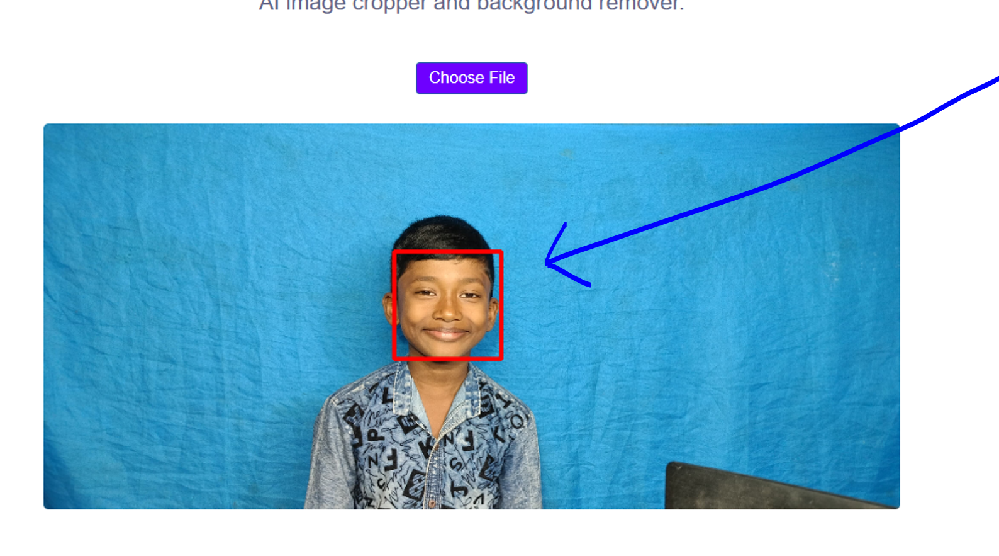

### 2. Automatically Crop the Image Based on Face Position
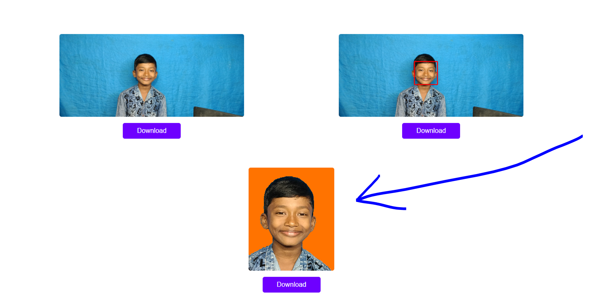

### 3. Direct Print Option
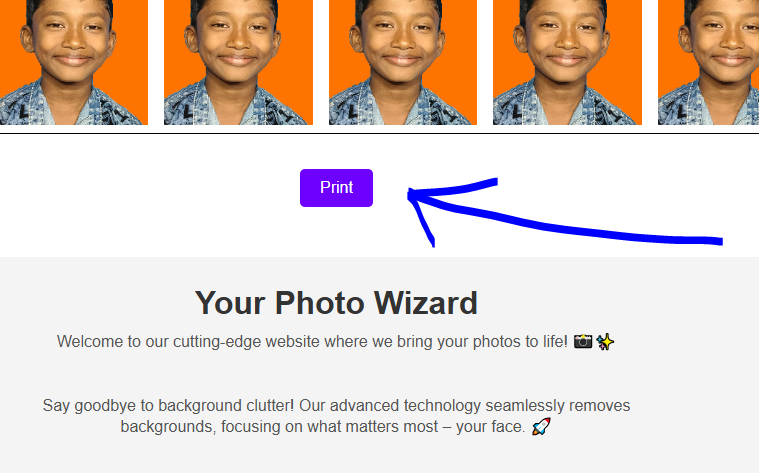

### 4. Face Detection
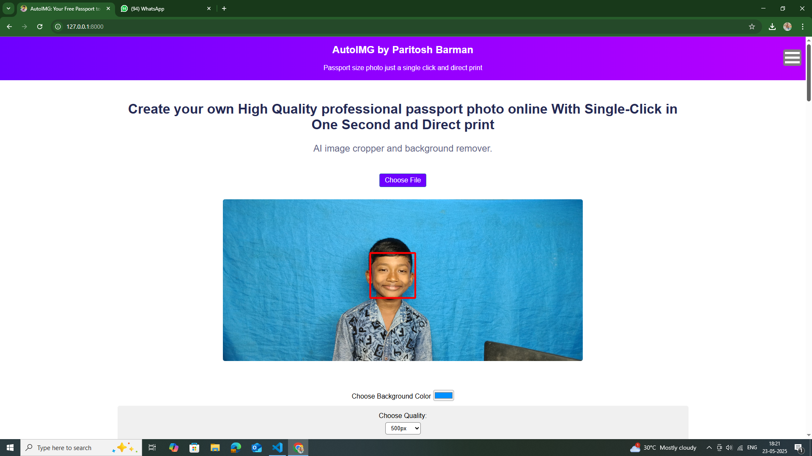

### 5. Input Image
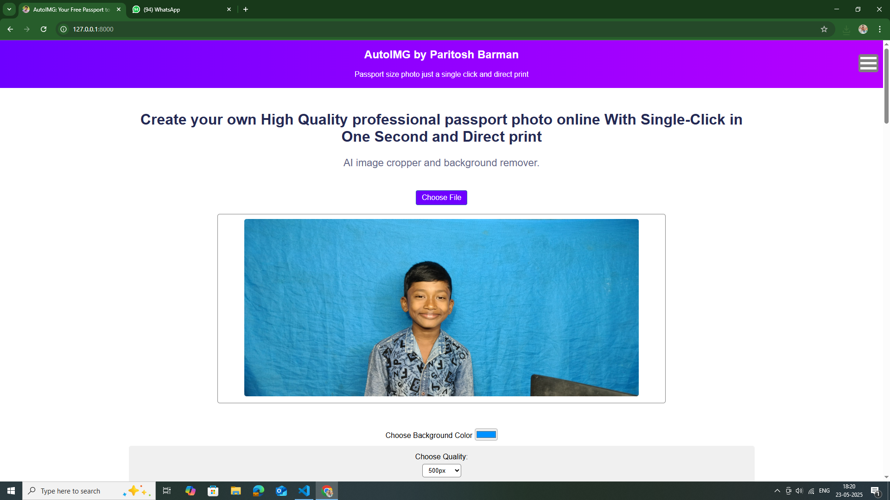

### 6. Choose Features and Options
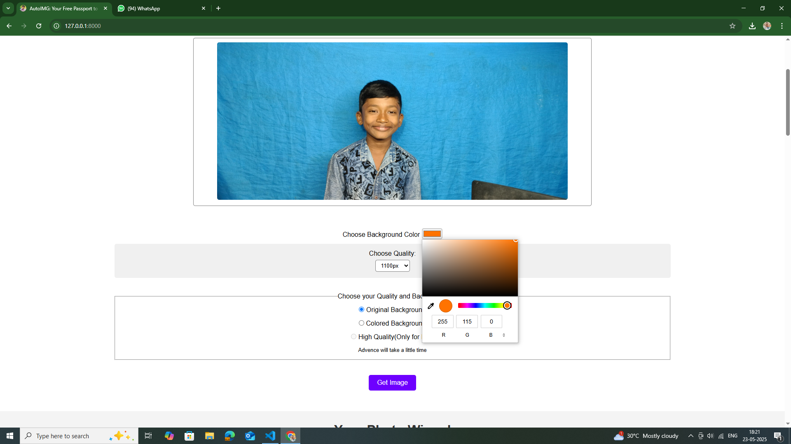

### 7. Indicate Features
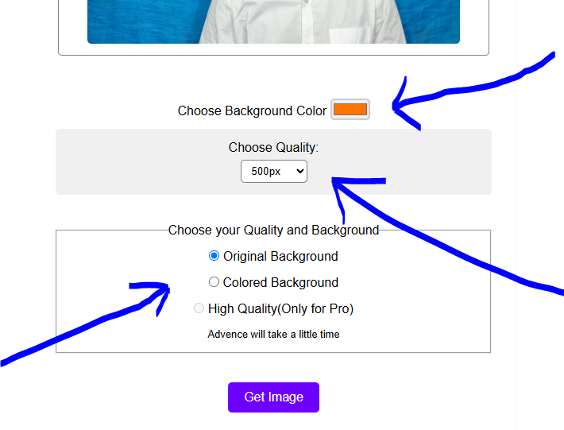

### 8. Image Copy Required
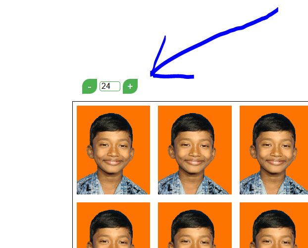

### 9. Multiple Photo Copies
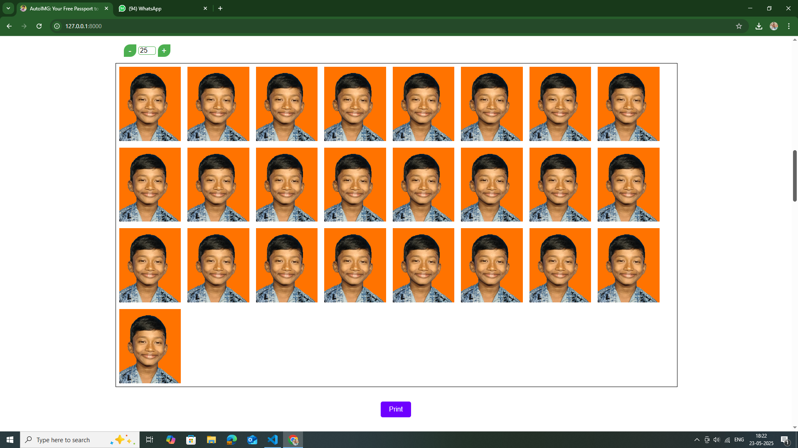

### 10. Photo Copy
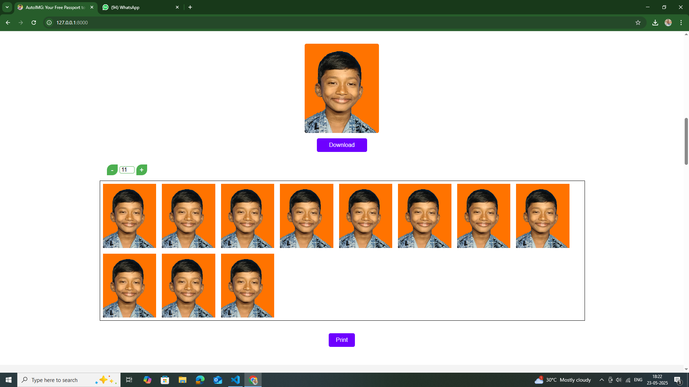

### 11. Final Print Output
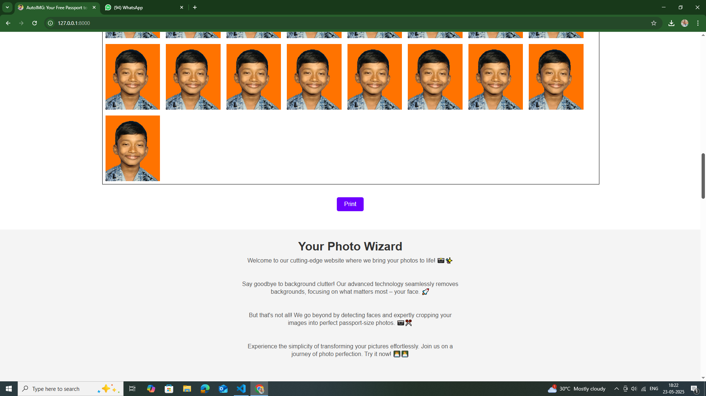

### 12. Three Image Output
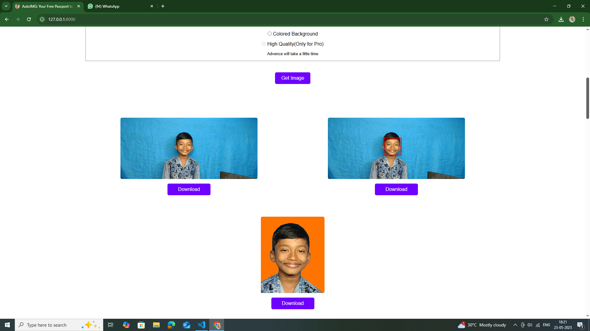

## 👤 Author
Paritosh Barman  
[GitHub Profile](https://github.com/ParitoshBarman)
📧 Email: paritoshpuitta@gmail.com  
📱 WhatsApp: +919091467852
